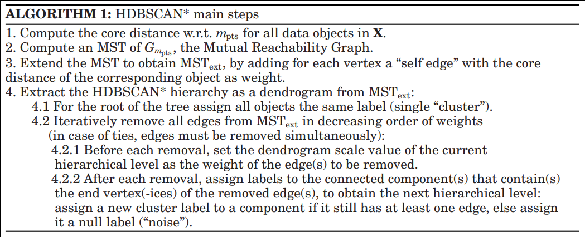

# HDBSCAN (Hierarchical density based clustering)



## TODOs until next meeting:

### Tobia
Optimize Prim with vector intrinsics. \
Small fixes in Python / shell scripts.

### Martin
Create table of optimizations implemented so far, including their approximate resulting speedup. \
Find cause of inconsistencies when using perf and Hotspot.

### Alex
Memory optimization in distance matrix computation (only compute upper diagonal).

### Tom
Take care of memory alignment (32 bytes) when reading in dataset. \
Fix small bug in cluster extraction.

## Setting this up

```bash
mkdir build && cd build
cmake -G Ninja ..
ninja        # building binaries
ninja check  # running tests
```

## CMake arguments
Note that all of these arguments are cached by CMake (i.e. need to be explicitly set to 0 again after having them used).
### General arguments
* `-DHDBSCAN_VERBOSE`: enable or disable (default) verbose mode by setting to 1 or 0; do not enable when benchmarking!
* `-DHDBSCAN_DATA_DIR`: absolute path to folder with generated input files. Defaults to <project-dir>/data
* `-DHDBSCAN_INSTRUMENT`: enable or disable (default) cost analysis instrumentation. Do not enable when benchmarking as it adds extra operations!
* `-DCMAKE_CXX_COMPILER`: Choose your compiler (i.e. `g++`, `clang++`). Defaults to `g++`
* `-DOPT_LEVEL`: Choose your compiler optimization level (i.e. `O0`, `O1`). Defaults to `O3`
* `-BENCHMARK_AMD`: enable when using an AMD system for benchmarking (not fully verified correctness yet). See the comments in `benchmark_util.h`

### Arguments to determine algorithm version
* `-DHDBSCAN_PRECOMPUTE_DIST`: enable or disable full computation of the pairwise distance matrix. If set to 0, only the `core_distances`
are precomputed and the prim algorithm implicitly assumes the mutual reachability graph.

### Print CMake arguments at runtime
Including the header file `config.h` (generated by CMake) grants access to CMake variables through preprocessor directives at runtime (see `main.cpp`).
You can add further CMake variables in `config.h.in`. Custom CMake variables have to be added with `#cmakedefine ...`.

### Ninja targets

* `all`: builds `hdbscan` and `hdbscan_vec` (default)
* `benchmark`: build and run non-vectorized benchmark
* `benchmark_vec`: build and run vectorized benchmark
* `build_bench`: build only non-vectorized benchmark but do not run it
* `build_bench_vec`: build only vectorized benchmark but do not run it
* `check`: build and run unit tests

## Benchmarking

You might need to install the `perf` tool to run the benchmarks.
Benchmarking is currently set up for the Intel Skylake architecture and AMD processor family 17h.
Please see and modify the event and unmask values in `benchmark_util.h` if needed. To run the benchmark with the current build: `ninja benchmark`

Note! If all flop counts stay at zero, it might be that your user does not have the permission to see kernel PMU events. To fix this, try
```
sudo sysctl -w kernel.perf_event_paranoid=-1
```
This gives the user access to (almost) all events.
Reference [here](https://www.kernel.org/doc/Documentation/sysctl/kernel.txt).

### Scripts
We have prepared the following scripts to run multiple benchmarks and plot the performance measurements:
  * `benchmarks.sh` is the entrypoint to a specific comparison as well as **all** experiments. It should generate data, build the project with different flags, execute benchmarks and save plotted results (i.e. calls all scripts outlined below).
    * Usage: `./benchmarks.sh [intel|amd] [baseline_flags|...|all]` (add new comparisons here).
  * ```run_perf_measurements.sh``` is the script that is called by the above `benchmarks.sh`. It executes a specific binary with different csv inputs.
    * Usage: `run_perf_measurements.sh <benchm_name> <binary_name> <filebase> <n>`. 
  * `helper_scripts/generate_clusters.py` generates and stores data as `data/perf_data_d<x>_<n>.csv`, for example `perf_data_d2_7.csv` where `d` is number of feature dimensions. The sizes of inputs are roughly evenly spaced from 32 to 14436.
    * Usage: `generate_clusters.py <relative_data_folder_path> <n_clusters> <d_dimensions>`
  * `helper_scripts/plot_performance_alt.py` creates a nice performance plot close to what was given in the lecture guidelines on benchmarking.
    * Usage: `plot_performance_alt.py --system [intel|amd] --data-path <data/timings/> --files <x1.csv> ... <xn.csv> --save-path <file>`
  * Other useful scripts, e.g. plotting clusters: See [`helper_scripts/`](helper_scripts).

Please see the outline and TODOs in `benchmarks.sh`.
## References

[R. J. G. B. Campello, D. Moulavi, A. Zimek, and J. Sander, “Hierarchical density estimates for data clustering, visualization, and outlier detection”](https://dl.acm.org/doi/pdf/10.1145/2733381)

[L. McInnes and J. Healy, “Accelerated hierarchical density based clustering”](https://arxiv.org/pdf/1705.07321.pdf)

[https://github.com/ojmakhura/hdbscan](https://github.com/ojmakhura/hdbscan)

[https://github.com/rohanmohapatra/hdbscan-cpp](https://github.com/rohanmohapatra/hdbscan-cpp)


# Team 35
© Tobia Claglüna, Martin Erhart, Alexander Hägele, Tom Lausberg
